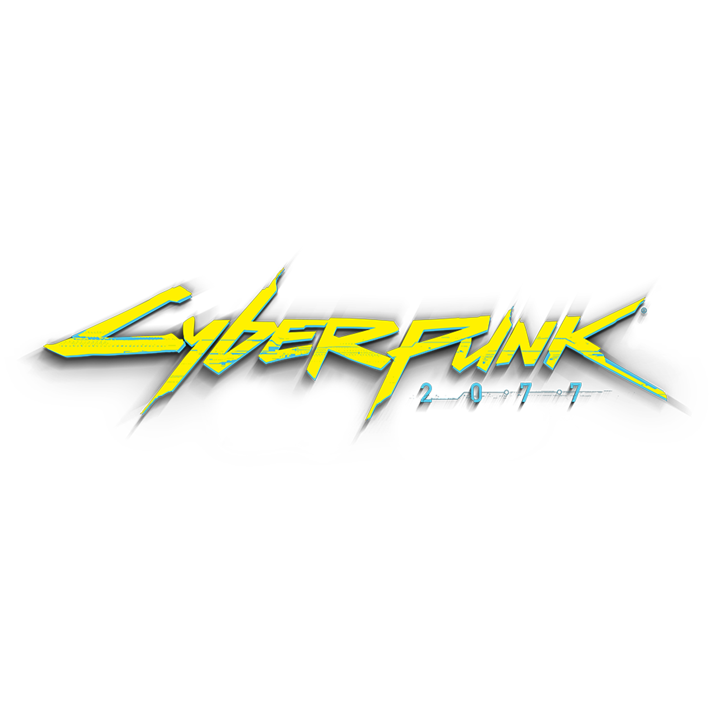

<a name="readme-top">

<br/>

<br />
<div align="center">
  <a href="https://https://github.com/Mikaelaa05">
    
  </a>

  <h3 align="center">AD-Final-Project</h3>
</div>

<div align="center">
  A full-stack PHP + PostgreSQL + MongoDB web application with Dockerized development and user authentication. (AD-Final-Project)
</div>

<br/>

[](https://wakatime.com/badge/user/018ee98a-e312-42fb-ac75-7e01d98002aa/project/329812e0-14f1-4c63-bb76-11e38eb7aa64)

---

<details>
  <summary>Table of Contents</summary>
  <ol>
    <li>
      <a href="#overview">Overview</a>
      <ol>
        <li>
          <a href="#key-components">Key Components</a>
        </li>
        <li>
          <a href="#technology">Technology</a>
        </li>
        <li>
          <a href="#quick-start">Quick Start</a>
        </li>
      </ol>
    </li>
    <li>
      <a href="#rule,-practices-and-principles">Rules, Practices and Principles</a>
    </li>
    <li>
      <a href="#resources">Resources</a>
    </li>
  </ol>
</details>

---

## Overview

AD-Final-Project is a modern PHP web application template for rapid development with Docker, PostgreSQL, and MongoDB. It features a modular structure, user authentication (login, signup, logout), and a ready-to-use database seeding/migration system. The project is designed for portability—anyone can clone, set up, and run it on their own machine with minimal configuration.

**Key Features:**
- User registration, login, and logout with secure password hashing
- PostgreSQL and MongoDB integration (with Docker Compose)
- Database migration, seeding, and reset utilities (with UUID support)
- Modular PHP structure (components, layouts, handlers, utils)
- Environment variable management via `.env`
- Custom error pages and handler-based error/status exposure
- Centralized routing with `router.php` for clean URLs and navigation
- Multi-table seeding: users, projects, tasks, project_users
- Ready for deployment or classroom demonstration

---

**Cyberpunk E-Commerce Additions:**
- Cyberpunk-themed shop selling augments and energy sources
- Product catalog with images, categories, prices, and stock
- Customers can register, browse, add to cart, and checkout
- Real-time stock management and session-based cart
- Admin dashboard for product and stock management
- Orders and order items tables for full e-commerce flow
- Advanced error handling with cyberpunk-styled error pages
- Responsive dashboard and shop UI with custom CSS

---

**Database System:**
- Separate tables for users (admins/team), customers, products, orders, and order_items
- Static data for users, customers, and products in `/staticData/dummies`
- SQL models for all tables in `/database`
- Utilities for migrate, seed, reset, and verify for each table
- Unified status check script: `utils/allDatabasesStatus.util.php`

---

**Cart & Stock Management:**
- Cart operations: add, update, remove, clear, get
- Stock reserved when added to cart, restored when removed
- Checkout process deducts stock and creates orders
- Admins can adjust stock and manage products
- All operations use database transactions for safety
- Session-based cart with security and persistence

---

**Cyberpunk Theming:**
- Custom dashboard and shop CSS (`assets/css/dashboard.css`, `assets/css/shop.css`)
- Neon colors, dark backgrounds, and futuristic fonts and UI
- Cyberpunk branding
- Team and company branding on About page
- Custom product images with cyberpunk style and alt/caption text for accessibility

---

**Error Handling:**
- Centralized ErrorHandler utility (`utils/errorHandler.util.php`)
- Dedicated error pages for unauthorized, bad request, not found, server error, and database issues
- Consistent cyberpunk styling for error pages
- Error logging and user-friendly messages

---

**Admin Features:**
- Admin dashboard for product management (`pages/Admin/index.php`)
- Add/edit/remove products, adjust stock, view orders
- Role-based access control (admin, designer, QA, etc.)

---

**Database Utilities:**
- Migrate, seed, reset, and verify commands for users, customers, products, orders, order_items
- Batch setup commands for all tables
- Status check script shows table existence and population

---

**Session & Security:**
- Cart tied to authenticated user sessions
- Input validation and sanitization throughout
- SQL injection prevention with prepared statements
- Passwords hashed securely

---

**Testing & Monitoring:**
- Logging for cart and stock operations
- Recommended testing scenarios for concurrency, stock depletion, error recovery
- Monitoring metrics: cart abandonment, order value, stock turnover

---

**Future Enhancements:**
- Wishlist, inventory alerts, bulk cart actions, price history, recommendations, mobile API, analytics dashboard

---

### Key Components

| Component             | Purpose                                                               | Technologies & Interactions                                                                 |
| --------------------- | --------------------------------------------------------------------- | ------------------------------------------------------------------------------------------- |
| **Auth Module**       | Handles user registration, login, logout, and session management.     | PHP sessions, PostgreSQL (users table), password hashing/verification.                      |
| **Database Checkers** | Verifies DB connectivity on load.                                     | PHP, PDO for PostgreSQL, MongoDB PHP extension.                                             |
| **Seeder/Migration**  | Automates DB schema creation and dummy data population.               | PHP CLI scripts, Composer scripts, SQL model files, static data arrays, UUID support.       |
| **Error Handling**    | Custom error pages for unauthorized access and DB failures.           | PHP includes, `/errors` folder, handler-based error exposure.                               |
| **Frontend UI**       | Responsive pages for login, signup, dashboard, and error handling.    | HTML, CSS, PHP includes (components/layouts), minimal JS.                                   |
| **Dockerized Stack**  | Ensures consistent environment for all users.                         | Docker Compose, Dockerfile, .env, Apache, PHP extensions.                                   |
| **Central Router**    | Clean URL routing for all requests.                                   | `router.php`, PHP built-in server, Apache in Docker.                                        |
| **Cart & Stock**      | E-commerce cart and stock management system.                          | PHP, PostgreSQL, session management, AJAX, error handling.                                  |
| **Admin Dashboard**   | Product and stock management for admins.                              | PHP, PostgreSQL, role-based access, custom UI.                                              |

---

### Quick Database Management Commands

```sh
# Migrate all tables
docker exec adfinalproject-service php /var/www/html/utils/dbMigratePostgresql.util.php

# Seed all tables
docker exec adfinalproject-service php /var/www/html/utils/dbSeederPostgresql.util.php

# Reset all tables
docker exec adfinalproject-service php /var/www/html/utils/dbResetPostgresql.util.php

# Check database status
docker exec adfinalproject-service php /var/www/html/utils/allDatabasesStatus.util.php
```

**Individual Table Utilities:**
```sh
docker exec adfinalproject-service php /var/www/html/utils/usersTableMigrate.util.php
docker exec adfinalproject-service php /var/www/html/utils/customersTableMigrate.util.php
docker exec adfinalproject-service php /var/www/html/utils/productsTableMigrate.util.php
# ... and corresponding Seeder, Reset, Verify scripts for each table
```

---

**Shop & Cart API Endpoints:**
- `/handlers/cart.handler.php` for cart operations (add, update, remove, clear, get)
- `/handlers/checkout.handler.php` for checkout processing

---

**Database Schema Highlights:**
- `users`: Admins/team, with roles and secure passwords
- `customers`: Registered buyers, with contact info and address
- `products`: Cyberpunk augments, energy sources, with images and stock
- `orders` & `order_items`: Full order tracking and checkout

---

**Team & About Page:**
- Company: SINTHESIZE Corp.
- Team roles: Database Manager, QA Manager, Backend, Designer, Front-End Developer
- About page with team bios and photos

---

**Docs & Manuals:**
- `/docs/Cart Functionality.md`: Cart and stock management details
- `/docs/Stock Management.md`: Stock flow, session, security, error handling, frontend integration
- `/docs/Error Handling System Status.md`: Error handling standards and coverage
- `/docs/Separate Database Utilities Manual.md`: Individual table utilities and setup

---

### Technology

#### Language


#### Framework/Library


#### Databases


#### Deployment


---

#### Tooling & Extensions


-blue?style=for-the-badge)

---

## Quick Start

### 1. Clone the repository
```sh
git clone https://github.com/Mikaelaa05/AD-Final-Project.git
cd AD-Final-Project
```

### 2. Copy the environment file
```sh
cp .env.example .env
# Or create .env manually using the provided keys
```

### 3. Install Composer dependencies
```sh
composer install
```

### 4. Start Docker containers
```sh
docker compose up
```

### 5. Run database migrations and seeders
```sh
composer postgresql:migrate
composer postgresql:seed
```

### 6. Access the app
- Visit [http://localhost:9000](http://localhost:9000) in your browser.

### 7. Default users
- See `staticData/dummies/users.staticData.php` for seeded users.
- Or register a new user via the Sign Up page.

---

## Rules, Practices and Principles

1. Always use `AD-` in the front of the Title of the Project for the Subject followed by your custom naming.
2. Do not rename `.php` files if they are pages; always use `index.php` as the filename.
3. Add `.component` to the `.php` files if they are components code; example: `footer.component.php`.
4. Add `.util` to the `.php` files if they are utility codes; example: `account.util.php`.
5. Place Files in their respective folders.
6. Different file naming Cases
   | Naming Case | Type of code         | Example                           |
   | ----------- | -------------------- | --------------------------------- |
   | Pascal      | Utility              | Account.util.php                  |
   | Camel       | Components and Pages | index.php or footer.component.php |
8. Renaming of Pages folder names are a must, and relates to what it is doing or data it holding.
9. Use proper label in your github commits: `feat`, `fix`, `refactor` and `docs`
10. File Structure to follow below.

```
AD-ProjectName
└─ assets
|   └─ css
|   |   └─ name.css
|   └─ img
|   |   └─ name.jpeg/.jpg/.webp/.png
|   └─ js
|       └─ name.js
└─ components
|   └─ name.component.php
|   └─ templates
|      └─ name.component.php
└─ handlers
|   └─ name.handler.php
└─ layout
|   └─ name.layout.php
└─ pages
|  └─ pageName
|     └─ assets
|     |  └─ css
|     |  |  └─ name.css
|     |  └─ img
|     |  |  └─ name.jpeg/.jpg/.webp/.png
|     |  └─ js
|     |     └─ name.js
|     └─ index.php
└─ staticData
|  └─ name.staticdata.php
└─ utils
|   └─ name.utils.php
└─ vendor
└─ .gitignore
└─ bootstrap.php
└─ composer.json
└─ composer.lock
└─ index.php
└─ readme.md
└─ router.php
```
> The following should be renamed: name.css, name.js, name.jpeg/.jpg/.webp/.png, name.component.php (but not the part of the `component.php`), Name.utils.php (but not the part of the `utils.php`)

---

## Resources

| Title                   | Purpose                                                               | Link                                                                       |
| ----------------------- | --------------------------------------------------------------------- | -------------------------------------------------------------------------- |
| GitHub Copilot          | In-IDE code suggestions and boilerplate generation.                   | [https://github.com/features/copilot](https://github.com/features/copilot) |
| Docker Documentation    | Reference for Docker and Compose setup.                               | [https://docs.docker.com/](https://docs.docker.com/)                       |
| PHP Official Docs       | Reference for PHP language and extensions.                            | [https://www.php.net/manual/en/](https://www.php.net/manual/en/)           |
| PostgreSQL Docs         | Reference for PostgreSQL database.                                    | [https://www.postgresql.org/docs/](https://www.postgresql.org/docs/)       |
| MongoDB Docs            | Reference for MongoDB database.                                       | [https://www.mongodb.com/docs/](https://www.mongodb.com/docs/)             |
| DBMC/DBCode Extension   | Manage and browse your DB from VS Code.                               | [https://marketplace.visualstudio.com/items?itemName=cweijan.dbclient](https://marketplace.visualstudio.com/items?itemName=cweijan.dbclient) |
| System Documentation    | Internal docs from PHP, MongoDB, and PostgreSQL used in development.  | — (see `/docs` folder in repo)                                             |

---

**For any issues, see the `/docs` folder or open an issue on GitHub.**